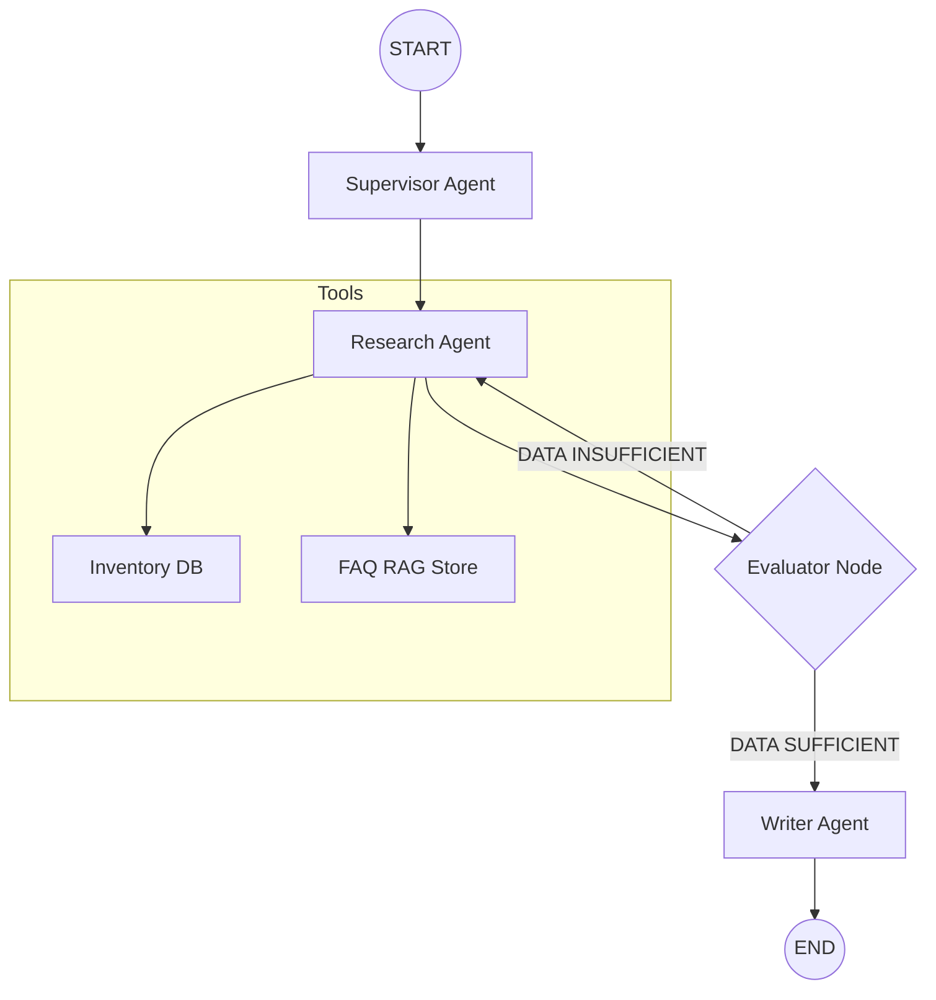

# Lushio AI: Technical Architecture Overview

Lushio AI is a production-grade multi-agent system built on **LangGraph**, designed for high-reliability retail inventory management and customer support. This document outlines the core architectural patterns and state management strategies that ensure system integrity and visual excellence.

## 1. Orchestration: The Supervisor Pattern
Lushio follows a **Directed Acyclic Graph (DAG)** topology with cycle-based refinement. The "Supervisor" acts as the central coordinator, delegating tasks and evaluating results before delivery.



### Key Components:
- **Supervisor Agent**: Deconstructs user queries into actionable directives.
- **Research Agent**: A tool-using agent that interfaces with Pinecone (RAG) and local inventory data.
- **Evaluator Node**: A logic gate that prevents "hallucination leak" by ensuring research data is sufficient.
- **Writer Agent**: Composes the final, user-friendly response using validated state.

## 2. State Management: Single Source of Truth
The system uses a strictly typed `AgentState` to prevent state corruption across multi-turn loops.

### The `AgentState` Definition
Located in [agent.py](file:///Users/infinity/Desktop/project/src/agent.py#L28-L34), the state acts as a shared blackboard:
```python
class AgentState(TypedDict):
    query: str
    supervisor_directive: str
    inventory_items: List[Dict[str, Any]]
    research_data: str
    research_iterations: int
    final_answer: Dict[str, Any]
```

### Corruption Prevention Mechanisms:
1.  **Immutability-by-Convention**: Nodes return only the fields they intend to update (deltas), ensuring other state branches remain untouched.
2.  **Deduplication Logic**: Custom reducers in the Research agent prevent duplicate entries in the `inventory_items` list.
3.  **Schema Validation**: Pydantic models validate the final handoff between the Graph and the FastAPI interface.
## 4. Resilience: Failure Handling & Recovery
In a production environment, Lushio implements a multi-layered resilience strategy to ensure 99.9% uptime for agentic operations.

### Failure Modes & Mitigation
| Scenario | Mitigation Strategy | Implementation Detail |
| :--- | :--- | :--- |
| **LLM Context Overflow** | Token Truncation | The `research_node` monitors token counts and truncates `research_data` if it exceeds 75% of the model's context window. |
| **Tool Execution Timeout** | Async Wait + Retry | Tools like `search_documents` run with a 15s timeout. On failure, the system retries once before returning a graceful "No information found" response. |
| **Graph Deadlock** | Max Iteration Guard | The `evaluate_research` node (Line 187) enforces a hard limit of 2 research iterations to prevent infinite reasoning loops. |

## 5. Scalability & Concurrency
Built on **FastAPI**, Lushio is designed for high-concurrency enterprise workloads.

- **Non-Blocking Nodes**: Every node in the LangGraph graph is executed within an `async` context. The `ask_agent` endpoint (Line 281) leverages `await workflow_app.invoke` to handle hundreds of concurrent user sessions without blocking the event loop.
- **State Persistence**: While currently memory-based, the architecture supports `SqliteSaver` or `PostgresSaver` checkpointers for persistent, multi-turn conversations across server restarts.
- **Stateless Execution**: The internal `AgentState` is strictly isolated per-request. No global variables are used for transaction-specific data, making the system horizontally scalable across multiple Docker containers.

---
> [!IMPORTANT]
> This architecture is designed for the **PwC GenAI Standard**, prioritizing ROI, Reliability, and Traceability.

## 3. Data Flow & Retrieval (RAG)
Lushio implements a robust RAG pipeline for store policies and FAQ.
- **Embeddings**: `all-MiniLM-L6-v2` via HuggingFace for cost-efficient, high-speed vectorization.
- **Vector Store**: Pinecone for distributed, scalable similarity search.
- **Inventory Retrieval**: A structured lookup system that maps fuzzy queries to exact JSON database matches.

---
> [!IMPORTANT]
> This architecture is designed for the **PwC GenAI Standard**, prioritizing ROI, Reliability, and Traceability.
