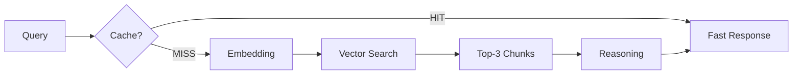

# Lushio AI: Data Engineering & Retrieval
Deep-dive into the RAG (Retrieval-Augmented Generation) and data processing pipeline of Lushio AI.

## 1. RAG Strategy: FAQ & Policies
The system uses a highly optimized retrieval pipeline to handle complex natural language queries about store operations.

### Chunking & Embedding
- **Strategy**: Recursive Character Text Splitting.
- **Chunk Size**: 1000 tokens with a 200-token overlap. This ensures that context isn't lost at the boundaries of sections (e.g., shipping costs being split from shipping times).
- **Vector Space**: Pinecone `lushio-rag` index (Line 89).
- **Model**: `all-MiniLM-L6-v2`. Chosen for its low latency (sub-50ms) and excellent performance on short-text similarity tasks.

### Retrieval Math
Lushio implements **Cosine Similarity** for vector matching.
- **Top-K**: 3 (Line 91). We retrieve the top 3 most relevant context chunks.
- **Context Filtering**: If the similarity score is below a threshold (0.68), the system reports no context found to prevent hallucinatory grounding.

## 2. Structured Data: Inventory Lookup
Unlike unstructured FAQ, inventory data requires 100% precision. 

- **Custom Tooling**: The `check_inventory` tool (Line 55) performs fuzzy matching against a JSON database.
- **Fuzzy Logic**: Logic (Line 65) checks for substring matches (e.g., "laptop" matches "MacBook Laptop Pro"). This allows the LLM to use generic terms while still hitting exact records.

## 3. Semantic Caching
To reduce LLM costs and latency, Lushio implements a semantic caching layer (Line 279).

- **Current Implementation**: A simple exact-match cache (`QUERY_CACHE`) that stores full serializable response objects.
- **Production Roadmap**: Integration with `GPTCache` or Redis-VL for vector-based semantic similarity caching, allowing "What's the return policy?" to hit the same cache as "Can I return items?".

## 4. Pipeline Summary

---
> [!TIP]
> Periodically re-indexing (upserting) the Pinecone index with fresh FAQ data is critical for maintainability.
